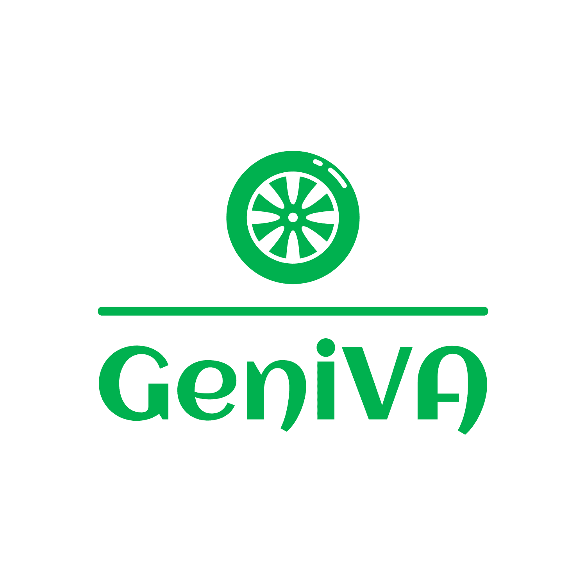

<br>
<div align="center">
    <div >
        
    </div>
    <div>
            <h3><b>GeniVA</b></h3>
            <p><i><b>G</b>enerative AI for <b>En</b>hanced <b>I</b>nteractions and Experiences <b>V</b>irtual <b>A</b>ssistant
</i></p>
    </div>      
</div>
<br>
<h1 align="center">GeniVA Backend Service</h1>
The backbone of our solution: GeniVA's backend system powers the platform with robust and secure infrastructure, managing data seamlessly, facilitating real-time interactions, and ensuring smooth integration with AI. GeniVA streamlines the user experience, offers cost-effective travel options, provides personalized recommendations based on emotional states and situations, and encourages small, regular savings through collaboration with financial partners.

## 👨🏻‍💻 &nbsp;Technology Stack

<div align="center">

<a href="https://go.dev/">
<kbd>

</kbd>
</a>

<a href="https://gin-gonic.com/">
<kbd>

</kbd>
</a>

<a href="https://gorm.io/">
<kbd>

</kbd>
</a>

<a href="https://www.postgresql.org/">
<kbd>

</kbd>
</a>

<a href="https://www.digitalocean.com/">
<kbd>

</kbd>
</a>

<a href="https://www.docker.com/">
<kbd>

</kbd>
</a>

</div>
<div align="center">
<h4>Go | Gin | Gorm | PostgreSQL | Digital Ocean | Docker</h4>
</div>

## ⚙️ &nbsp;How to Run

1. Clone this repository from terminal using this following command
    ```bash
    $ git clone https://github.com/GeniVA-HackJakarta/geniva-backend.git
    ```
2. Create a `.env` file inside the repository directory using `.env.example` file as the template. You should add information about your own Google project to the `.env` file
3. Run the server using this following command, make sure you have Docker Desktop on your device.
    ```bash
    $ docker compose up
    ```
4. GeniVA backend server should be running. You can also check the server by opening http://localhost:8080

## 🔑 &nbsp;List of Endpoints

| Endpoint               | Method | Usage                                                  |
| ---------------------- | :----: | ------------------------------------------------------ |
| /api/auth/register     |  POST  | Users can register and create account on GeniVA        |
| /api/auth/login        |  POST  | Users can login to GeniVA using their existing account |
| /api/user              |  GET   | Users can get essential informations about users       |
| /api/user/:user_id/kyc |  PUT   | Users can update their KYC data                        |
| /api/history/:user_id  |  GET   | Users can retrieve their history data                  |
| /api/order/            |  POST  | Users can order Grab service                           |
| /api/ai/:user_id       |  POST  | Users can communicate with AI GeniVA                   |
| /api/price/calculate   |  POST  | Users can saving in their purchase to Superbank        |

## 👥 &nbsp;Contributors

| <a href="https://github.com/michaelsht"></a>                                                                                                        | <a href="https://github.com/NnA301023"></a>                                                                                            | <a href="https://github.com/TimothySubekti0322"></a>                                                                                        | <a href="https://github.com/AustinPardosi"></a>                                                                                                                  |
| --------------------------------------------------------------------------------------------------------------------------------------------------- | -------------------------------------------------------------------------------------------------------------------------------------- | ------------------------------------------------------------------------------------------------------------------------------------------- | ---------------------------------------------------------------------------------------------------------------------------------------------------------------- |
| <div align="center"><h3><b><a href="https://github.com/michaelsht">Michael Sihotang</a></b></h3><i><p>Bandung Institute of Technology</i></p></div> | <div align="center"><h3><b><a href="github.com/NnA301023">M. Alif Ramadhan</a></b></h3></a><p><i>Singaperbangsa Karawang</i></p></div> | <div align="center"><h3><b><a href="TimothySubekti0322">Timothy Subekti</a></b></h3></a><p><i>Bandung Institute of Technology</i></p></div> | <div align="center"><h3><b><a href="https://github.com/AustinPardosi">Austin Gabriel Pardosi</a></b></h3></a><p><i>Bandung Institute of Technology</i></p></div> |
